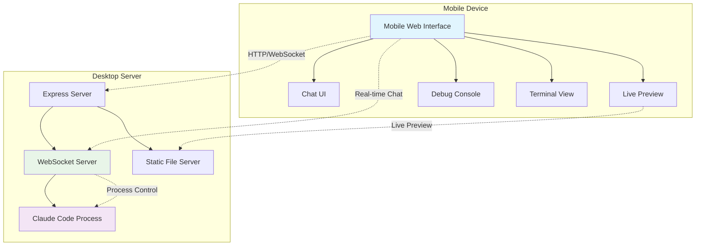

# Claude Bridge

> Bridge the gap between desktop AI coding tools and mobile accessibility

Claude Bridge enables developers to seamlessly control and monitor AI-assisted development workflows from mobile devices while keeping the computational power and security of desktop development environments.

## 🚀 Features

### Core Capabilities
- **📱 Mobile Control**: Full Claude Code interaction from mobile browsers
- **⚡ Real-time Monitoring**: Live updates of development progress and issues
- **🔗 Zero-friction Setup**: Connect mobile to desktop with single QR code scan
- **🔒 Local-first Security**: All data stays within your local network

### What You Can Do
- Start a Claude Code session on desktop and continue guiding it from your phone
- Monitor AI coding sessions during meetings or while away from desk
- Share live AI coding progress with team members
- Debug and provide guidance from anywhere

## 🎯 Use Cases

- **Remote Development**: Continue AI coding workflows during commutes or meetings
- **Team Collaboration**: Observe and guide AI coding sessions from mobile
- **Education**: Demonstrate AI coding workflows to students on mobile
- **Client Work**: Monitor project progress while traveling

## 🏗️ Architecture

## 📄 License

This project is licensed under the MIT License - see the [LICENSE](LICENSE) file for details.

## 🙏 Acknowledgments

- [Claude Code](https://claude.ai/code) - The amazing AI coding assistant that makes this possible
- [Anthropic](https://anthropic.com) - For creating Claude and advancing AI safety

---

**Made with ❤️ for the developer community**

*Bridge your AI coding workflows across all your devices*